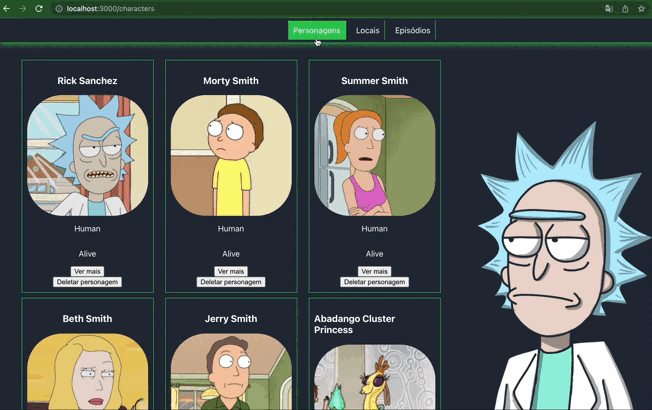

# Rick and Morty React Testing Library

## O que vamos desenvolver

Nesse desafio queremos que você teste a aplicação acima para colocar em prática alguns conceitos da Biblioteca [React Testing Library](https://testing-library.com/docs/react-testing-library/intro/).

### Habilidades que queremos praticar
* Utilizar os seletores (queries) da React-Testing-Library em testes automatizados;
* Simular eventos com a React-Testing-Library em testes automatizados;
* Testar fluxos lógicos assíncronos com a React-Testing-Library;

Diferente dos primeiros projetos de front que são bem guiados aqui você terá mais libertade para construir seus testes.

## Dicas e Avisos
* Esse desafio tem como objetivo ser executado na mentoria invertida que tem duração de 50 min, se atentem ao tempo que vão demorar para decidir o que fazer.

# Requisitos
### 1. Verifique se os links de cabaçalho estão corretos
  - Verifique se no cabeçalho os links `Personagens`, `Locais` e `Episódios` estão presentes

### 2. Verifique se os personagens são renderizados na página de `/characters`
  - Verique se existem 20 cards de personagens

### 3. Verifique se o `Card` do personagem é renderizado corretamente
  - Verifique se o card contém as seguintes informações do personagem: `Nome` e `Imagem`

### 4. Verifique se a funcionalidade de `Ver mais` está funcionando
  - Verifique se ao clicar no botão `Ver mais` as seguintes informações do personagem serão renderizadas na tela: `Gender` e `Location`
  - Verifique se é possível voltar para a página `/characters` ao clicar no botão `Voltar`

### 5. Verifique se é possível deletar algum card
  - Verifique se ao clicar no botão `Deletar personagem` o card é retirado da tela
